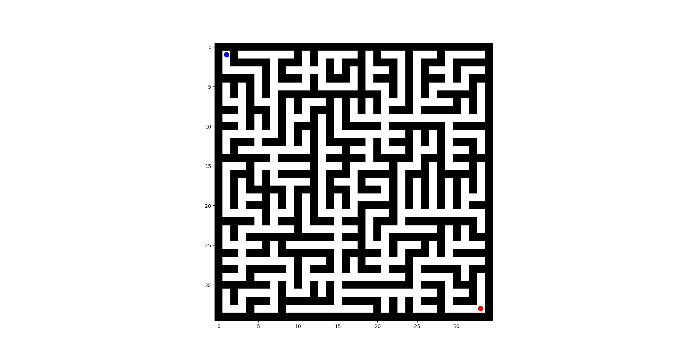

# Maze Solver using Monte Carlo Tree Search (MCTS) and Uniform Cost Search (UCS)

How to use:
1. Create a virtual environment
2. Run `pip install -r requirements.txt` to install all necessary package
3. Edit `config.py`
4. Comment and Uncomment the necessary code in `main.py` then run it by `python main.py`

## Important Note
1. If the maze is too complex, the program will take a long time to solve it.
2. If MCTS can not return the result, try to increase the number of iteration in the config file.
3. This code is tested on Python 3.11.6 in Windows 11 and Ubuntu 22.04 (Debian and Linux not tested yet).

# This code is written by: Minh Huy Pham for the course: Knowledge Representation and Reasoning
